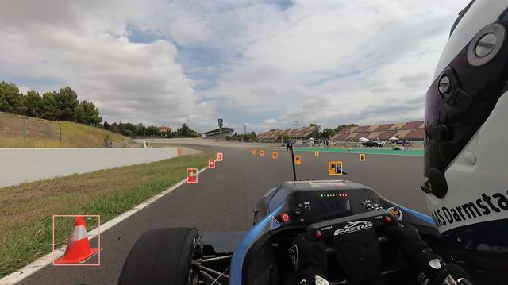

# StereoCamera cone detection
This subdirectory is arranged to host the stereocamera cone detection.

## Setup
_**It's higly recommended to take a look at the notebook for a better understanding of the workflow.**_
### Repositories and requirements
Before you start working with the project, remember to clone this repository.
```
git clone "https://github.com/unipi-smartapp-2021/lidar-cone-detection"
```
And the official yolov5 repository too (we're deciding if to use it as submodule or not).
```
git clone "https://github.com/ultralytics/yolov5"
```
Install the requirements for the model correct working.
```python
pip install -r requirements.txt
pip install -r yolov5/requirements.txt  # not needed if we decide to use yolov5 as submodule
```
### Managing the dataset
Upload the dataset in the apposite directories following what is suggested in https://github.com/ultralytics/yolov5/wiki/Train-Custom-Data, section 1.3, or use ```manage_dataset.py``` to let it do the entire work.

**Before you proceed:** the datasets we worked on are on a shared drive since they are too big to be uploaded here on github, so if you want to try the notebook you should build your own dataset (or you can ask us to share the drive, we're not that strict).

After you managed to split the dataset in train, validation and test sets (this last one is not required for the yolov5), create three more files (```train.txt```, ```validation.txt``` and ```test.txt```) and write the paths to the images on them.

**Modify the .yaml file to your needs**, this is vital to work with yolov5 on a custom dataset.
```yaml
# Train/val/test sets as 1) dir: path/to/imgs, 2) file: path/to/imgs.txt, or 3) list: [path/to/imgs1, path/to/imgs2, ..]
path: datasets/your_dataset # dataset root dir
train: train.txt # train images (relative to 'path')
val: validation.txt # val images (relative to 'path')
test: test.txt # test images (optional)
# Classes
nc: 4 # number of classes
names: ['big','orange','yellow','blue'] # class names
```
### Importing the model
It's recommended by the yolov5 team to work with a pretrained model and not with one built from scratch (in that case you need to configure the entire model).

You can find the weights of the various pretrained models (base, small, large etc.) on https://github.com/ultralytics/yolov5/releases, the following is an example of importing one of them:
```python
import requests
url = 'https://github.com/ultralytics/yolov5/releases/download/v6.0/yolov5s.pt'
r = requests.get(url, allow_redirects=True)
open('yolov5s.pt', 'wb').write(r.content)
```
## Training
To train the model we absolutely suggest you to follow this guide https://github.com/ultralytics/yolov5/blob/master/tutorial.ipynb.
```python
python yolov5/train.py --img 640 --batch 16 --epochs 10 --data path/to/your_yaml.yaml --weights yolov5s.pt
```
Use ```--cache``` to cache the train and validation sets before starting the training and use ```--project``` to specify where to save the results (the main guide suggests to save them in runs/train). Under the directory where you saved your results you will also find the last and best weigths of the model.
## Evaluation and inference
The evaluation on labeled data (the validation or test set specified on your .yaml file) is done by using val.py.
```python
python yolov5/val.py --weights best.pt --img 640 --conf 0.5 --data path/to/your_yaml.yaml --task test
```
The weights should be in /runs/train/exp/weights if you just did the training, otherwise give the actual path. We suggest, as for the training, to use ```--project``` to save the results in runs/test. ```--task test``` **is necessary to infere on the test set otherwise the model will work on the validation set**.

**If you're using non labeled data (your custom image), then detect.py must be used.**
```python
python yolov5/detect.py --weights best.pt --img 640 --conf 0.5 --source path/to/your_image.png
```
Save the results by using ```--project runs/detect```, you can also use the following arguments (those can be used even for the evaluation task):
- _--save-txt_, save the labels (useful to locate the cones).
- _--nosave_, don't save the labeled image.
- _--exist-ok_, to use the same directory for the results.
- _--project_ runs/detect, where to save the results.
- _--hide-labels_, don't show the labels on the detected cones.
- _--hide-conf_, don't show the confidence on each detected cone-

## Use the model from the pytorch hub
You can also try to inference on your model by using it from the pytorch hub, for more details follow this guide https://github.com/ultralytics/yolov5/issues/36.
```python
import torch
model = torch.hub.load('ultralytics/yolov5', 'custom', path=your_weights)
results = model(path_to_image)
```
